# GridPorter Agent Architecture

## Overview

GridPorter uses a vision-enabled AI orchestration architecture where Large Language Models (LLMs) with vision capabilities guide the table detection process, with local algorithms providing verification and refinement. This approach enables understanding of complex spreadsheet structures that traditional algorithms miss.

## Architecture Principles

1. **Vision-First Detection**: Visual understanding drives initial table identification
2. **AI-Guided Orchestration**: LLMs coordinate the detection pipeline based on visual analysis
3. **Local Verification**: Deterministic algorithms validate AI proposals for reliability
4. **Semantic Preservation**: Maintain table meaning and structure during extraction
5. **Rich Metadata Output**: Provide comprehensive information for perfect data import

## Agent Workflow with Input/Output Specifications

```mermaid
graph TD
    subgraph "Initial Processing"
        Start(["📁 File Input<br/>━━━━━━━━━━<br/>IN: file_path, options<br/>OUT: file_path, file_bytes"])
        -->|"file_path<br/>file_bytes"| FileTypeDetect["🔍 File Type Detection<br/>━━━━━━━━━━<br/>IN: file_path, file_bytes<br/>OUT: file_format, parser, sheets"]

        FileTypeDetect -->|"file_path<br/>sheet_name<br/>parser"| DataPreprocess["🔎 Data Region Pre-process<br/>━━━━━━━━━━<br/>IN: sheet_data<br/>OUT: data_regions[], empty_regions[]"]

        DataPreprocess -->|"sheet_data<br/>data_regions"| BitmapGen["🟦 Multi-Scale Bitmap Gen<br/>━━━━━━━━━━<br/>IN: sheet_data, regions<br/>OUT: overview, detail_views[]"]

        BitmapGen -->|"multi_scale<br/>bitmaps"| BasicDetect["🔲 Pattern Detection<br/>━━━━━━━━━━<br/>IN: overview, regions<br/>OUT: patterns[], confidence"]
    end

    subgraph "Vision Preparation"
        BasicDetect -->|"patterns<br/>regions"| QuadtreeAnalysis["🌳 Quadtree Analysis<br/>━━━━━━━━━━<br/>IN: patterns, regions<br/>OUT: focus_areas[], strategy"]

        QuadtreeAnalysis -->|"multi_scale<br/>bitmaps<br/>strategy"| OptimizedBitmap["🖼️ Vision Request Builder<br/>━━━━━━━━━━<br/>IN: bitmaps, strategy<br/>OUT: vision_request{}"]
    end

    subgraph "Vision Analysis & Verification"
        OptimizedBitmap -->|"vision_request<br/>with metadata"| VisionLLM["🤖 Vision-Enabled LLM<br/>━━━━━━━━━━<br/>IN: multi_scale_images[]<br/>OUT: exact_bounds[], confidence"]

        VisionLLM -->|"proposals[]<br/>insights"| RegionProposal["📋 Region Proposals<br/>━━━━━━━━━━<br/>IN: vision_analysis, regions<br/>OUT: region_proposals[]"]

        RegionProposal -->|"proposal<br/>bounds"| LocalVerify{"✅ Local Verification<br/>━━━━━━━━━━<br/>IN: sheet_data, proposal<br/>OUT: is_valid, metrics"}

        LocalVerify -->|"❌ Invalid<br/>feedback"| Feedback["🔄 Feedback to LLM<br/>━━━━━━━━━━<br/>IN: invalid_proposals<br/>OUT: refined_prompt"]

        Feedback -->|"refined_prompt<br/>retry_params"| VisionLLM
    end

    subgraph "Data Extraction"
        LocalVerify -->|"✓ Valid<br/>verified_region"| GeometryCheck["📐 Geometry Analysis<br/>━━━━━━━━━━<br/>IN: sheet_data, region<br/>OUT: geometry, patterns"]

        GeometryCheck -->|"geometry<br/>bounds"| TableExtract["📊 Table Extraction<br/>━━━━━━━━━━<br/>IN: sheet_data, geometry<br/>OUT: raw_data[][], metadata"]

        TableExtract -->|"raw_data<br/>metadata"| SemanticAnalysis["🧠 Semantic Analysis<br/>━━━━━━━━━━<br/>IN: raw_data, insights<br/>OUT: table_type, complexity"]
    end

    subgraph "Feature Processing"
        SemanticAnalysis -->|"semantic_analysis"| ComplexFeatures{"🔀 Complex Features?<br/>━━━━━━━━━━<br/>IN: semantic_analysis<br/>OUT: decision, routing"}

        ComplexFeatures -->|"📑 Complex<br/>header_info"| HeaderAnalysis["📑 Multi-row Headers<br/>━━━━━━━━━━<br/>IN: raw_data, header_struct<br/>OUT: unified_headers[]"]

        ComplexFeatures -->|"🎨 Complex<br/>format_info"| FormatAnalysis["🎨 Format Preservation<br/>━━━━━━━━━━<br/>IN: metadata, structure<br/>OUT: formatting_rules"]

        ComplexFeatures -->|"📝 Simple<br/>table_data"| SimpleExtract["📝 Simple Extraction<br/>━━━━━━━━━━<br/>IN: table_data, analysis<br/>OUT: headers[], data[][]"]
    end

    subgraph "Final Assembly"
        HeaderAnalysis -->|"headers<br/>mappings"| Consolidate["🔗 Consolidate Results<br/>━━━━━━━━━━<br/>IN: all_extractions<br/>OUT: consolidated_table"]
        FormatAnalysis -->|"format_rules"| Consolidate
        SimpleExtract -->|"simple_table"| Consolidate

        Consolidate -->|"consolidated<br/>table"| MetadataGen["📝 Generate Metadata<br/>━━━━━━━━━━<br/>IN: table, insights<br/>OUT: pandas_config, hints"]

        MetadataGen -->|"metadata<br/>table_info"| NameGen["🏷️ Name Generation<br/>━━━━━━━━━━<br/>IN: table_data, headers<br/>OUT: name, description"]

        NameGen -->|"complete<br/>result"| Output(["📦 Rich JSON Output<br/>━━━━━━━━━━<br/>IN: all_tables, metrics<br/>OUT: extraction_result{}"])
    end

    style DataPreprocess fill:#e1f5e1
    style BitmapGen fill:#e1f5e1
    style BasicDetect fill:#e1f5e1
    style QuadtreeAnalysis fill:#e1f5e1
    style OptimizedBitmap fill:#e1f5e1
    style FileTypeDetect fill:#e1f5e1
    style LocalVerify fill:#e1f5e1
    style GeometryCheck fill:#e1f5e1
    style TableExtract fill:#e1f5e1
    style SimpleExtract fill:#e1f5e1
    style Consolidate fill:#e1f5e1
    style Feedback fill:#e1f5e1
    style VisionLLM fill:#ffcccc
    style RegionProposal fill:#ffcccc
    style SemanticAnalysis fill:#ffe4b5
    style HeaderAnalysis fill:#ffe4b5
    style FormatAnalysis fill:#ffe4b5
    style MetadataGen fill:#ffe4b5
    style NameGen fill:#ffcccc
```



### Data Flow Legend

- **file_path**: Path to spreadsheet file
- **file_bytes**: First 1KB for magic detection
- **bitmap[][]**: Binary array (1=filled, 0=empty)
- **regions[]**: Detected connected components with bounds
- **viz_plan**: Quadtree-based visualization strategy
- **images[]**: PNG bitmaps for vision analysis
- **proposals[]**: AI-proposed table regions
- **raw_data[][]**: Extracted cell values
- **metadata**: Cell types, formats, merged cells
- **pandas_config**: Ready-to-use pd.read_excel() parameters

### Processing Type Legend
- 🟢 **Green**: Local processing (deterministic)
- 🟠 **Orange**: Hybrid AI + Local processing
- 🔴 **Red**: AI/LLM processing (vision or text)

### Icon Legend
- 📁 File operations
- 🔍 Detection/Analysis
- 🟦 Bitmap operations
- 🖼️ Image generation
- 🤖 AI/Vision model
- ✅ Verification
- 📐 Geometry
- 📊 Data extraction
- 🧠 Semantic understanding
- 🔀 Decision points
- 📑 Header processing
- 🎨 Format handling
- 📝 Text/metadata
- 🏷️ Naming
- 📦 Final output

## Detailed Step Specifications

### 0. Start (File Input)

**Description**: Initial entry point receiving file path or file object

**Input**:
```json
{
  "file_path": "path/to/spreadsheet.xlsx",
  "options": {
    "sheets": null,  // null for all sheets, or ["Sheet1", "Sheet2"]
    "max_file_size_mb": 100,
    "timeout_seconds": 300,
    "vision_model": "gpt-4o",
    "enable_caching": true
  }
}
```

**Output**:
```json
{
  "file_path": "path/to/spreadsheet.xlsx",
  "file_bytes": "<first 1024 bytes for magic detection>",
  "request_id": "req_12345",
  "timestamp": "2024-01-15T10:30:00Z"
}
```

### 1. File Type Detection

**Agent**: FileTypeDetectorAgent

**Input**:
```json
{
  "file_path": "path/to/spreadsheet.xlsx",
  "file_bytes": "<first 1024 bytes for magic detection>"
}
```

**Processing**:
- Use python-magic to detect actual file type
- Validate against expected extensions
- Determine appropriate parser

**Output**:
```json
{
  "detected_type": "application/vnd.openxmlformats-officedocument.spreadsheetml.sheet",
  "file_format": "xlsx",
  "parser": "openpyxl",
  "confidence": 1.0,
  "sheets": ["Sheet1", "Sheet2", "Data"],
  "file_size_bytes": 1048576,
  "processing_hints": {
    "is_large": false,
    "estimated_cells": 50000
  }
}
```

### 2. Binary Bitmap Generation

**Agent**: BitmapGeneratorAgent

**Input**:
```json
{
  "file_path": "path/to/spreadsheet.xlsx",
  "sheet_name": "Sheet1",
  "file_format": "xlsx",
  "parser": "openpyxl"
}
```

**Processing**:
- Load sheet data efficiently
- Detect data regions for optimization
- Generate multi-scale bitmaps with Excel-proportioned compression
- Create both overview and detail views

**Output**:
```json
{
  "sheet_info": {
    "total_rows": 100000,
    "total_cols": 2000,
    "data_bounds": {"min_row": 0, "max_row": 50000, "min_col": 0, "max_col": 500}
  },
  "compression_levels": [
    {"level": 0, "blocks": [1, 1], "description": "No compression (1 pixel = 1 cell)"},
    {"level": 1, "blocks": [16, 1], "description": "16:1 ratio"},
    {"level": 2, "blocks": [64, 1], "description": "64:1 ratio (Excel-proportioned)"},
    {"level": 3, "blocks": [256, 4], "description": "256:4 ratio (maintains 64:1)"},
    {"level": 4, "blocks": [1024, 16], "description": "1024:16 ratio (maintains 64:1)"},
    {"level": 5, "blocks": [4096, 64], "description": "4096:64 ratio (maintains 64:1)"}
  ],
  "multi_scale_bitmaps": {
    "overview": {
      "compression_level": 3,
      "bitmap": "base64_encoded_png",
      "dimensions": {"rows": 196, "cols": 125},
      "block_size": [256, 4],
      "size_bytes": 24500,
      "covers_range": "A1:AXX50000"
    },
    "data_regions": [
      {
        "region_id": "header",
        "bounds": {"top": 0, "left": 0, "bottom": 10, "right": 100},
        "compression_level": 0,
        "bitmap": "base64_encoded_png",
        "dimensions": {"rows": 11, "cols": 101},
        "size_bytes": 1111,
        "description": "Full resolution for precise header detection"
      },
      {
        "region_id": "main_data",
        "bounds": {"top": 11, "left": 0, "bottom": 5000, "right": 100},
        "compression_level": 1,
        "bitmap": "base64_encoded_png",
        "dimensions": {"rows": 312, "cols": 101},
        "size_bytes": 31512
      }
    ]
  },
  "generation_time_ms": 523
}
```

### 2a. Data Region Pre-processing

**Description**: Fast scan to identify regions with actual data

**Input**:
```json
{
  "sheet_info": {
    "total_rows": 100000,
    "total_cols": 2000
  },
  "sheet_data": "<sheet_data_reference>"
}
```

**Processing**:
- Binary scan to find cells with data
- Group into connected regions
- Merge nearby regions (configurable gap)
- Calculate density and size metrics

**Output**:
```json
{
  "data_regions": [
    {
      "region_id": "region_1",
      "bounds": {"top": 0, "left": 0, "bottom": 10, "right": 100},
      "cell_count": 850,
      "density": 0.77,
      "characteristics": {
        "likely_headers": true,
        "mostly_text": true,
        "has_formatting": true
      }
    },
    {
      "region_id": "region_2",
      "bounds": {"top": 11, "left": 0, "bottom": 5000, "right": 100},
      "cell_count": 350000,
      "density": 0.71,
      "characteristics": {
        "likely_data": true,
        "mixed_types": true
      }
    }
  ],
  "empty_regions": [
    {"bounds": {"top": 5001, "left": 0, "bottom": 99999, "right": 1999}}
  ],
  "total_data_regions": 2,
  "sheet_utilization": 0.04
}
```

### 3. Basic Region Detection

**Agent**: RegionDetectorAgent

**Input**:
```json
{
  "multi_scale_bitmaps": {
    "overview": {
      "compression_level": 3,
      "bitmap": "base64_encoded_png",
      "block_size": [256, 4]
    }
  },
  "data_regions": [
    {"region_id": "region_1", "bounds": {...}},
    {"region_id": "region_2", "bounds": {...}}
  ]
}
```

**Processing**:
- Use overview bitmap for pattern detection
- Analyze data regions from pre-processing
- Identify potential table boundaries
- Mark regions needing detailed analysis

**Output**:
```json
{
  "detected_patterns": [
    {
      "pattern_id": "table_1",
      "region_ref": "region_1",
      "bounds": {"top": 0, "left": 0, "bottom": 10, "right": 100},
      "confidence": 0.85,
      "pattern_type": "structured_table",
      "needs_detail_view": true
    },
    {
      "pattern_id": "table_2",
      "region_ref": "region_2",
      "bounds": {"top": 11, "left": 0, "bottom": 5000, "right": 100},
      "confidence": 0.78,
      "pattern_type": "data_matrix",
      "needs_detail_view": true
    }
  ],
  "total_patterns": 2,
  "detection_method": "multi_scale_analysis",
  "detection_time_ms": 67
}
```

### 4. Quadtree Analysis

**Agent**: QuadtreeAnalyzerAgent

**Input**:
```json
{
  "bitmap": "[[...]]",
  "dimensions": {"rows": 1000, "cols": 50},
  "regions": [
    {
      "id": "region_1",
      "bounds": {"top": 0, "left": 0, "bottom": 100, "right": 25}
    }
  ]
}
```

**Processing**:
- Build quadtree respecting region boundaries
- Identify optimal visualization areas
- Plan bitmap generation strategy

**Output**:
```json
{
  "quadtree_levels": 5,
  "visualization_plan": {
    "regions_to_visualize": [
      {
        "region_id": "region_1",
        "visualization_bounds": {"top": 0, "left": 0, "bottom": 100, "right": 25},
        "resolution": "full",
        "estimated_size_bytes": 250000
      }
    ],
    "total_images": 2,
    "total_size_mb": 15.5
  },
  "optimization_applied": "region_based_clustering",
  "analysis_time_ms": 78
}
```

### 5. Optimized Bitmap Generation

**Agent**: OptimizedBitmapAgent

**Input**:
```json
{
  "sheet_data": "<sheet_data_reference>",
  "visualization_plan": {
    "regions_to_visualize": [
      {
        "region_id": "region_1",
        "visualization_bounds": {"top": 0, "left": 0, "bottom": 100, "right": 25},
        "resolution": "full"
      }
    ]
  }
}
```

**Processing**:
- Prepare multi-scale image set for vision analysis
- Include overview and detail views
- Add explicit compression metadata
- Ensure total size < 20MB

**Output**:
```json
{
  "vision_request": {
    "images": [
      {
        "image_id": "overview",
        "image_data": "base64_encoded_png_data",
        "compression_level": 3,
        "block_size": [256, 4],
        "description": "OVERVIEW: Full sheet at 256:4 compression. Each pixel = 256 rows × 4 columns",
        "purpose": "Identify general table distribution",
        "covers_cells": "A1:AXX50000",
        "size_bytes": 245000
      },
      {
        "image_id": "detail_region_1",
        "image_data": "base64_encoded_png_data",
        "compression_level": 0,
        "block_size": [1, 1],
        "description": "DETAIL: Cells A1:CW11 at 1:1 scale. Each pixel = exactly 1 cell",
        "purpose": "Precise boundary detection for header region",
        "covers_cells": "A1:CW11",
        "size_bytes": 12000
      },
      {
        "image_id": "detail_region_2",
        "image_data": "base64_encoded_png_data",
        "compression_level": 0,
        "block_size": [1, 1],
        "description": "DETAIL: Cells A12:CW5000 at 1:1 scale. Each pixel = exactly 1 cell",
        "purpose": "Precise boundary detection for data region",
        "covers_cells": "A12:CW5000",
        "size_bytes": 489000
      }
    ],
    "total_images": 3,
    "total_size_mb": 0.73,
    "compression_strategy": "multi_scale_with_full_detail"
  },
  "generation_time_ms": 523
}
```

### 6. Vision LLM Analysis

**Agent**: VisionOrchestratorAgent

**Input**:
```json
{
  "vision_request": {
    "images": [
      {
        "image_id": "overview",
        "image_data": "base64_encoded_png_data",
        "compression_level": 3,
        "description": "OVERVIEW: Full sheet at 256:4 compression..."
      },
      {
        "image_id": "detail_region_1",
        "image_data": "base64_encoded_png_data",
        "compression_level": 0,
        "description": "DETAIL: Cells A1:CW11 at 1:1 scale..."
      }
    ]
  },
  "prompt_template": "EXPLICIT_MULTI_SCALE"
}
```

**Processing**:
- Construct explicit prompt explaining each image's compression
- Send multi-scale images to vision model
- Emphasize that detail views are for EXACT boundaries
- Request precise cell coordinates

**Prompt Structure**:
```
You are analyzing spreadsheet visualizations to detect table boundaries.

CRITICAL INFORMATION:
- Image 1 (overview): 256:4 compression for structure understanding
- Images 2+ (details): NO compression (1 pixel = 1 cell) for EXACT boundaries

YOUR TASK:
1. Use overview for general layout
2. Use detail views for PRECISE cell coordinates
3. Return EXACT row/column numbers
```

**Output**:
```json
{
  "proposals": [
    {
      "proposal_id": "table_1",
      "source_image": "detail_region_1",
      "exact_bounds": {
        "top_row": 5,
        "left_col": 2,
        "bottom_row": 10,
        "right_col": 98
      },
      "excel_range": "C6:CU11",
      "confidence": 0.95,
      "detection_notes": "Used detail view for precise boundaries",
      "characteristics": {
        "has_headers": true,
        "header_rows": 1,
        "title_rows": 1,
        "has_merged_cells": true
      }
    },
    {
      "proposal_id": "table_2",
      "source_image": "detail_region_2",
      "exact_bounds": {
        "top_row": 11,
        "left_col": 2,
        "bottom_row": 4998,
        "right_col": 98
      },
      "excel_range": "C12:CU4999",
      "confidence": 0.92,
      "detection_notes": "Large data table with consistent structure",
      "characteristics": {
        "has_headers": false,
        "is_continuation": true,
        "data_patterns": "numeric_matrix"
      }
    }
  ],
  "model_used": "gpt-4o",
  "vision_time_ms": 2134,
  "images_analyzed": 3,
  "token_usage": {"prompt": 3200, "completion": 580}
}
```

### 6a. Region Proposals

**Description**: Vision model proposes specific table regions based on visual analysis

**Input**:
```json
{
  "vision_analysis": {
    "proposals": [...],
    "model_used": "gpt-4o",
    "vision_insights": {...}
  },
  "original_regions": [
    {
      "id": "region_1",
      "bounds": {"top": 0, "left": 0, "bottom": 100, "right": 25}
    }
  ]
}
```

**Processing**:
- Extract individual proposals from vision analysis
- Map proposals to original regions
- Prepare for verification

**Output**:
```json
{
  "region_proposals": [
    {
      "proposal_id": "table_1",
      "region_id": "region_1",
      "bounds": {"top": 5, "left": 2, "bottom": 95, "right": 22},
      "confidence": 0.92,
      "characteristics": {...},
      "ready_for_verification": true
    }
  ],
  "total_proposals": 1,
  "high_confidence_count": 1
}
```

### 7. Local Verification

**Agent**: RegionVerifierAgent

**Input**:
```json
{
  "sheet_data": "<sheet_data_reference>",
  "proposal": {
    "proposal_id": "table_1",
    "bounds": {"top": 5, "left": 2, "bottom": 95, "right": 22},
    "confidence": 0.92
  }
}
```

**Processing**:
- Extract actual data from proposed bounds
- Verify rectangularness and consistency
- Generate feedback if invalid

**Output** (Valid):
```json
{
  "proposal_id": "table_1",
  "is_valid": true,
  "metrics": {
    "rectangularness": 0.89,
    "filledness": 0.76,
    "consistency": 0.91,
    "column_alignment": 0.95
  },
  "verification_time_ms": 34
}
```

**Output** (Invalid):
```json
{
  "proposal_id": "table_1",
  "is_valid": false,
  "feedback": {
    "issue": "low_rectangularness",
    "message": "Region contains disconnected data. Consider bounds adjustment.",
    "suggested_bounds": {"top": 5, "left": 2, "bottom": 85, "right": 22}
  },
  "metrics": {
    "rectangularness": 0.45,
    "filledness": 0.76
  }
}
```

### 7a. Feedback to LLM

**Description**: Provide feedback to Vision LLM when verification fails

**Input**:
```json
{
  "invalid_proposals": [
    {
      "proposal_id": "table_1",
      "original_bounds": {"top": 5, "left": 2, "bottom": 95, "right": 22},
      "issue": "low_rectangularness",
      "metrics": {
        "rectangularness": 0.45,
        "filledness": 0.76
      },
      "suggested_bounds": {"top": 5, "left": 2, "bottom": 85, "right": 22}
    }
  ],
  "original_image": {
    "region_id": "region_1",
    "image_data": "base64_encoded_png_data"
  },
  "iteration": 1
}
```

**Processing**:
- Compile feedback from failed verifications
- Create refined prompt for vision model
- Include specific guidance based on failure type

**Output**:
```json
{
  "refined_prompt": "Previous analysis identified tables with low rectangularness. Please re-analyze focusing on:\n1. Ensure table boundaries exclude disconnected data\n2. Look for natural breaks in data continuity\n3. Consider the suggested bounds: top=5, left=2, bottom=85, right=22",
  "feedback_type": "bounds_adjustment",
  "retry_parameters": {
    "focus_areas": ["rectangularness", "data_continuity"],
    "confidence_threshold": 0.85
  }
}
```

### 8. Geometry Analysis

**Agent**: GeometryAnalyzerAgent

**Input**:
```json
{
  "sheet_data": "<sheet_data_reference>",
  "verified_region": {
    "proposal_id": "table_1",
    "bounds": {"top": 5, "left": 2, "bottom": 95, "right": 22}
  }
}
```

**Processing**:
- Analyze structural patterns
- Detect merged cells
- Identify data boundaries

**Output**:
```json
{
  "proposal_id": "table_1",
  "geometry": {
    "actual_data_bounds": {"top": 5, "left": 2, "bottom": 93, "right": 22},
    "merged_cells": [
      {"top": 5, "left": 2, "bottom": 5, "right": 10}
    ],
    "empty_rows": [15, 45, 75],
    "empty_cols": [],
    "border_style": "full_grid"
  },
  "structural_patterns": {
    "has_spanning_headers": true,
    "has_subtotal_rows": [44, 74, 93],
    "indentation_levels": [0, 1, 2]
  },
  "analysis_time_ms": 67
}
```

### 9. Table Extraction

**Agent**: TableExtractorAgent

**Input**:
```json
{
  "sheet_data": "<sheet_data_reference>",
  "geometry": {
    "actual_data_bounds": {"top": 5, "left": 2, "bottom": 93, "right": 22},
    "merged_cells": [{"top": 5, "left": 2, "bottom": 5, "right": 10}]
  }
}
```

**Processing**:
- Extract raw data values
- Preserve cell types and formats
- Handle merged cells

**Output**:
```json
{
  "proposal_id": "table_1",
  "raw_data": [
    ["Sales Report", null, null, null, null],
    ["Category", "Q1", "Q2", "Q3", "Q4"],
    ["Electronics", 15000, 18000, 22000, 25000],
    ["  Computers", 8000, 9500, 11000, 13000],
    ["  Phones", 7000, 8500, 11000, 12000]
  ],
  "cell_metadata": [
    [
      {"type": "string", "format": "bold", "merged": true},
      null, null, null, null
    ],
    [
      {"type": "string", "format": "bold"},
      {"type": "string", "format": "bold"},
      {"type": "string", "format": "bold"},
      {"type": "string", "format": "bold"},
      {"type": "string", "format": "bold"}
    ]
  ],
  "extraction_time_ms": 89
}
```

### 10. Semantic Analysis

**Agent**: SemanticAnalyzerAgent

**Input**:
```json
{
  "raw_data": [["Sales Report", null, null, null, null], ...],
  "cell_metadata": [...],
  "geometry": {...},
  "vision_insights": {
    "table_type": "financial_data",
    "suggested_purpose": "Monthly sales report with product categories"
  }
}
```

**Processing**:
- Analyze data patterns
- Identify semantic structures
- Determine complexity level

**Output**:
```json
{
  "proposal_id": "table_1",
  "semantic_analysis": {
    "table_type": "hierarchical_financial",
    "header_structure": {
      "type": "multi_row",
      "title_row": 0,
      "column_headers_row": 1,
      "spans": [{"row": 0, "start_col": 0, "end_col": 4}]
    },
    "data_structure": {
      "has_hierarchy": true,
      "hierarchy_indicator": "indentation",
      "parent_rows": [2],
      "child_rows": [3, 4],
      "total_rows": [5, 10, 15]
    },
    "data_types": {
      "columns": [
        {"index": 0, "type": "category", "role": "row_header"},
        {"index": 1, "type": "numeric", "subtype": "currency"},
        {"index": 2, "type": "numeric", "subtype": "currency"},
        {"index": 3, "type": "numeric", "subtype": "currency"},
        {"index": 4, "type": "numeric", "subtype": "currency"}
      ]
    },
    "complexity_score": 0.75,
    "requires_special_handling": true
  },
  "analysis_time_ms": 234
}
```

### 10a. Complex Features Decision

**Description**: Determine if table requires complex handling based on semantic analysis

**Input**:
```json
{
  "semantic_analysis": {
    "table_type": "hierarchical_financial",
    "header_structure": {
      "type": "multi_row",
      "title_row": 0,
      "column_headers_row": 1
    },
    "data_structure": {
      "has_hierarchy": true,
      "hierarchy_indicator": "indentation"
    },
    "complexity_score": 0.75,
    "requires_special_handling": true
  }
}
```

**Processing**:
- Evaluate complexity score
- Check for specific complex features
- Route to appropriate handler

**Output**:
```json
{
  "decision": "complex",
  "reasons": [
    "multi_row_headers",
    "hierarchical_data",
    "high_complexity_score"
  ],
  "required_handlers": [
    "header_analysis",
    "format_preservation"
  ],
  "routing": {
    "next_steps": ["HeaderAnalysis", "FormatAnalysis"],
    "skip_simple_extract": true
  }
}
```

### 11. Complex Feature Handling

#### 11a. Multi-row Header Analysis

**Agent**: HeaderAnalyzerAgent

**Input**:
```json
{
  "raw_data": [...],
  "header_structure": {
    "type": "multi_row",
    "title_row": 0,
    "column_headers_row": 1,
    "spans": [{"row": 0, "start_col": 0, "end_col": 4}]
  }
}
```

**Output**:
```json
{
  "unified_headers": [
    "Category",
    "Sales Report - Q1",
    "Sales Report - Q2",
    "Sales Report - Q3",
    "Sales Report - Q4"
  ],
  "header_hierarchy": {
    "level_0": ["Sales Report"],
    "level_1": ["Category", "Q1", "Q2", "Q3", "Q4"]
  },
  "header_mapping": {
    "original_rows": [0, 1],
    "data_start_row": 2
  }
}
```

#### 11b. Format Preservation Analysis

**Agent**: FormatAnalyzerAgent

**Input**:
```json
{
  "cell_metadata": [...],
  "data_structure": {
    "has_hierarchy": true,
    "hierarchy_indicator": "indentation"
  }
}
```

**Output**:
```json
{
  "formatting_rules": {
    "hierarchy_preservation": {
      "method": "indentation_levels",
      "levels": {
        "0": {"prefix": "", "style": "bold"},
        "1": {"prefix": "  ", "style": "normal"},
        "2": {"prefix": "    ", "style": "italic"}
      }
    },
    "special_rows": {
      "totals": {
        "rows": [5, 10, 15],
        "style": "bold",
        "background": "#f0f0f0"
      }
    },
    "number_formats": {
      "columns": [1, 2, 3, 4],
      "format": "currency_usd"
    }
  }
}
```

### 11c. Simple Extract

**Description**: Direct extraction for simple tables without complex features

**Input**:
```json
{
  "table_data": {
    "raw_data": [
      ["Name", "Age", "City"],
      ["Alice", 30, "New York"],
      ["Bob", 25, "London"],
      ["Charlie", 35, "Tokyo"]
    ],
    "bounds": {"top": 0, "left": 0, "bottom": 3, "right": 2}
  },
  "semantic_analysis": {
    "table_type": "simple_data",
    "complexity_score": 0.2,
    "requires_special_handling": false
  }
}
```

**Processing**:
- Direct data extraction
- Basic header detection (first row)
- Simple type inference

**Output**:
```json
{
  "extracted_table": {
    "headers": ["Name", "Age", "City"],
    "data": [
      ["Alice", 30, "New York"],
      ["Bob", 25, "London"],
      ["Charlie", 35, "Tokyo"]
    ],
    "data_types": {
      "Name": "string",
      "Age": "integer",
      "City": "string"
    },
    "extraction_method": "simple",
    "processing_time_ms": 12
  }
}
```

### 12. Result Consolidation

**Agent**: ConsolidatorAgent

**Input**:
```json
{
  "extracted_data": {...},
  "semantic_analysis": {...},
  "header_analysis": {...},
  "format_analysis": {...}
}
```

**Output**:
```json
{
  "consolidated_table": {
    "id": "table_1",
    "bounds": {"top": 5, "left": 2, "bottom": 93, "right": 22},
    "headers": ["Category", "Sales Report - Q1", "Sales Report - Q2", "Sales Report - Q3", "Sales Report - Q4"],
    "data": [
      ["Electronics", 15000, 18000, 22000, 25000],
      ["  Computers", 8000, 9500, 11000, 13000],
      ["  Phones", 7000, 8500, 11000, 12000]
    ],
    "metadata": {
      "hierarchy_info": {...},
      "formatting_info": {...},
      "semantic_info": {...}
    }
  }
}
```

### 13. Metadata Generation

**Agent**: MetadataGeneratorAgent

**Input**:
```json
{
  "consolidated_table": {...},
  "vision_insights": {...},
  "processing_metrics": {...}
}
```

**Output**:
```json
{
  "table_metadata": {
    "id": "table_1",
    "pandas_config": {
      "header": [0, 1],
      "index_col": 0,
      "skiprows": [],
      "dtype": {
        "Category": "str",
        "Sales Report - Q1": "float64",
        "Sales Report - Q2": "float64",
        "Sales Report - Q3": "float64",
        "Sales Report - Q4": "float64"
      },
      "na_values": ["", "-", "N/A"],
      "thousands": ",",
      "parse_dates": false
    },
    "processing_hints": {
      "preserve_hierarchy": true,
      "hierarchy_method": "indentation_to_multiindex",
      "total_rows": [5, 10, 15],
      "skip_total_in_aggregations": true
    },
    "quality_metrics": {
      "completeness": 0.98,
      "consistency": 0.95,
      "accuracy_confidence": 0.93
    }
  }
}
```

### 14. Name Generation

**Agent**: NameGeneratorAgent

**Input**:
```json
{
  "table_data": {...},
  "vision_insights": {
    "suggested_purpose": "Monthly sales report with product categories"
  },
  "headers": ["Category", "Sales Report - Q1", ...],
  "sheet_name": "Sheet1"
}
```

**Output**:
```json
{
  "table_name": "sales_by_category_quarterly",
  "description": "Quarterly sales report broken down by product categories with subtotals",
  "suggested_variable_name": "df_sales_quarterly",
  "naming_confidence": 0.88,
  "alternative_names": [
    "quarterly_sales_report",
    "product_sales_by_quarter"
  ]
}
```

### 15. Output (Rich JSON Output)

**Description**: Final consolidated output with all extracted tables and metadata

**Input**:
```json
{
  "all_tables": [
    {
      "table_metadata": {...},
      "consolidated_table": {...},
      "name_info": {...}
    }
  ],
  "file_info": {
    "path": "path/to/spreadsheet.xlsx",
    "sheets_processed": ["Sheet1"]
  },
  "processing_summary": {
    "total_time_ms": 3456,
    "methods_used": ["vision_llm_gpt4o"],
    "api_calls": 1
  }
}
```

**Processing**:
- Aggregate all table results
- Add file-level metadata
- Include performance metrics
- Generate optimization suggestions

**Output**:
```json
{
  "status": "success",
  "extraction_result": {
    "file_info": {...},
    "tables": [...],
    "performance_metrics": {...},
    "detection_methods_used": [...],
    "optimization_suggestions": {...}
  },
  "errors": [],
  "warnings": []
}
```

## Final Rich JSON Output

The complete output that enables perfect pandas extraction:

```json
{
  "extraction_result": {
    "file_info": {
      "path": "path/to/spreadsheet.xlsx",
      "type": "xlsx",
      "size_bytes": 1048576,
      "sheets_processed": ["Sheet1"]
    },
    "tables": [
      {
        "id": "table_1",
        "sheet": "Sheet1",
        "name": "sales_by_category_quarterly",
        "description": "Quarterly sales report broken down by product categories with subtotals",

        "location": {
          "range": "C6:W94",
          "bounds": {"top": 5, "left": 2, "bottom": 93, "right": 22}
        },

        "structure": {
          "total_rows": 89,
          "total_cols": 5,
          "header_rows": 2,
          "data_rows": 87,
          "has_totals": true,
          "total_rows_indices": [5, 10, 15],
          "hierarchical": true,
          "hierarchy_levels": 3
        },

        "pandas_import": {
          "read_excel_kwargs": {
            "sheet_name": "Sheet1",
            "header": [0, 1],
            "index_col": 0,
            "nrows": 89,
            "usecols": "C:G",
            "dtype": {
              "Category": "str",
              "Sales Report - Q1": "float64",
              "Sales Report - Q2": "float64",
              "Sales Report - Q3": "float64",
              "Sales Report - Q4": "float64"
            },
            "na_values": ["", "-", "N/A"],
            "thousands": ","
          },
          "post_processing": {
            "convert_hierarchy": {
              "method": "indentation_to_multiindex",
              "indentation_char": " ",
              "levels": 3
            },
            "handle_totals": {
              "total_rows": [5, 10, 15],
              "action": "tag_not_remove"
            },
            "clean_headers": {
              "method": "flatten_multirow",
              "separator": " - "
            }
          }
        },

        "data_preview": {
          "headers": ["Category", "Sales Report - Q1", "Sales Report - Q2", "Sales Report - Q3", "Sales Report - Q4"],
          "first_rows": [
            ["Electronics", 15000, 18000, 22000, 25000],
            ["  Computers", 8000, 9500, 11000, 13000],
            ["  Phones", 7000, 8500, 11000, 12000],
            ["TOTAL Electronics", 15000, 18000, 22000, 25000]
          ]
        },

        "context": {
          "purpose": "Track quarterly sales performance by product category",
          "data_characteristics": {
            "temporal": "quarterly",
            "categorical": "product_hierarchy",
            "numerical": "currency_usd"
          },
          "business_rules": {
            "totals_calculation": "Sum of child categories",
            "hierarchy_meaning": "Product taxonomy (Category > Subcategory > Product)"
          }
        },

        "quality": {
          "detection_confidence": 0.92,
          "extraction_confidence": 0.95,
          "completeness": 0.98,
          "issues": []
        }
      }
    ],

    "performance_metrics": {
      "total_time_ms": 3456,
      "steps": {
        "file_detection": 23,
        "bitmap_generation": 125,
        "region_detection": 45,
        "vision_analysis": 1847,
        "verification": 34,
        "extraction": 89,
        "semantic_analysis": 234
      },
      "vision_api_calls": 1,
      "vision_tokens": {
        "prompt": 2500,
        "completion": 450,
        "total_cost_usd": 0.0125
      }
    },

    "detection_methods_used": [
      "connected_components",
      "vision_llm_gpt4o",
      "quadtree_optimization"
    ],

    "optimization_suggestions": {
      "cache_similar_structures": true,
      "suggested_bitmap_resolution": "adaptive",
      "batch_similar_sheets": ["Sheet2", "Sheet3"]
    }
  }
}
```

## Agent Responsibilities

### VisionOrchestratorAgent
- **Primary Role**: Coordinate the entire detection pipeline
- **Key Responsibilities**:
  - Manage workflow state and transitions
  - Handle retries and fallbacks
  - Aggregate results from all agents
  - Optimize API usage and costs
- **Success Criteria**:
  - All tables detected with >80% confidence
  - Total processing time under 5 seconds for standard files
  - Vision API costs minimized through smart batching

### TableDetectorAgent
- **Primary Role**: Execute table detection algorithms
- **Key Responsibilities**:
  - Run connected component analysis
  - Apply heuristic rules
  - Generate region proposals
- **Success Criteria**:
  - No valid tables missed
  - False positive rate < 5%
  - Processing time < 500ms for sheets under 10k cells

### RegionVerifierAgent
- **Primary Role**: Validate proposed table regions
- **Key Responsibilities**:
  - Check geometric properties
  - Verify data consistency
  - Provide corrective feedback
- **Success Criteria**:
  - Catch 95% of invalid proposals
  - Provide actionable feedback
  - Verification time < 50ms per region

### SemanticAnalyzerAgent
- **Primary Role**: Understand table meaning and structure
- **Key Responsibilities**:
  - Identify complex patterns (hierarchy, totals)
  - Determine data relationships
  - Suggest appropriate handling
- **Success Criteria**:
  - Correctly identify 90% of special structures
  - Provide clear semantic labels
  - Enable lossless data extraction

### NameGeneratorAgent
- **Primary Role**: Generate meaningful table names
- **Key Responsibilities**:
  - Analyze content and context
  - Suggest descriptive names
  - Provide alternatives
- **Success Criteria**:
  - Names are descriptive and valid Python identifiers
  - Capture table purpose in 3-5 words
  - No naming conflicts in workbook

## Pandas Integration Guide

### Basic Import
```python
import pandas as pd
from gridporter import extract_tables

# Get extraction result
result = extract_tables("sales_report.xlsx")

# For each table
for table in result['tables']:
    # Direct pandas import
    df = pd.read_excel(**table['pandas_import']['read_excel_kwargs'])

    # Apply post-processing
    if table['structure']['hierarchical']:
        df = apply_hierarchy_conversion(df, **table['pandas_import']['post_processing']['convert_hierarchy'])
```

### Hierarchy Handling
```python
def apply_hierarchy_conversion(df, method='indentation_to_multiindex', indentation_char=' ', levels=3):
    """Convert indented hierarchy to MultiIndex"""
    if method == 'indentation_to_multiindex':
        # Count indentation levels
        indent_levels = df.iloc[:, 0].apply(lambda x: len(x) - len(x.lstrip(indentation_char)))

        # Create MultiIndex
        indices = []
        for level in range(levels):
            mask = indent_levels == level
            indices.append(df.iloc[:, 0].where(mask).fillna(method='ffill'))

        df.index = pd.MultiIndex.from_arrays(indices)
        df.iloc[:, 0] = df.iloc[:, 0].str.strip()

    return df
```

### Total Row Handling
```python
def handle_total_rows(df, total_rows, action='tag_not_remove'):
    """Handle total/subtotal rows"""
    if action == 'tag_not_remove':
        # Add a column indicating total rows
        df['is_total'] = False
        df.loc[df.index[total_rows], 'is_total'] = True
    elif action == 'remove':
        # Remove total rows
        df = df.drop(df.index[total_rows])

    return df
```

## Performance Monitoring

### Workflow Optimization
The performance metrics in the output enable:

1. **Bottleneck Identification**: See which steps take longest
2. **Cost Tracking**: Monitor vision API usage and costs
3. **Cache Opportunities**: Identify similar structures for caching
4. **Batch Processing**: Group similar sheets for efficiency

### Tuning Parameters
```python
# Adjust based on performance metrics
config = {
    "vision_confidence_threshold": 0.8,  # Lower if missing tables
    "bitmap_resolution": "adaptive",     # Fixed resolution if consistent
    "enable_caching": True,             # Cache similar structures
    "batch_size": 5,                    # Process multiple sheets together
    "max_vision_retries": 2             # Retry on low confidence
}
```

## Progressive Refinement for Large Sheets

For spreadsheets exceeding memory or API limits, the system uses progressive refinement:

### Phase 1: Initial Overview
```json
{
  "strategy": "overview_first",
  "compression_level": 4,
  "purpose": "Identify general table locations"
}
```

### Phase 2: Targeted Detail Views
```json
{
  "strategy": "refine_boundaries",
  "regions": [
    {
      "initial_bounds": {"top": 0, "left": 0, "bottom": 1000, "right": 100},
      "refinement_margin": 20,
      "compression_level": 0,
      "purpose": "Get exact boundaries"
    }
  ]
}
```

### Phase 3: Boundary Verification
```json
{
  "strategy": "verify_edges",
  "focus_areas": ["top_edge", "bottom_edge", "left_edge", "right_edge"],
  "compression_level": 0,
  "cell_level_precision": true
}
```

## Multi-Scale Compression Levels

The system uses Excel-proportioned compression levels:

| Level | Row×Col Blocks | Use Case | Max Sheet Size |
|-------|----------------|----------|----------------|
| 0 | 1×1 | Small tables, precise boundaries | 100K cells |
| 1 | 16×1 | Medium tables | 1.6M cells |
| 2 | 64×1 | Large tables (Excel ratio) | 6.4M cells |
| 3 | 256×4 | Very large tables | 100M cells |
| 4 | 1024×16 | Huge tables | 1.6B cells |
| 5 | 4096×64 | Maximum Excel sheets | 16B cells |

## Summary

This enhanced architecture provides:

1. **Multi-Scale Analysis**: Overview for context, details for precision
2. **Excel-Proportioned Compression**: Matches Excel's 64:1 row:column ratio
3. **Smart Pre-processing**: Only processes regions with data
4. **Explicit Vision Prompts**: LLM knows exact compression of each image
5. **Progressive Refinement**: Handles sheets of any size efficiently
6. **Full Granularity**: Never loses precision for boundary detection

The result is a system that can handle massive spreadsheets while maintaining pixel-perfect accuracy for table boundaries.
