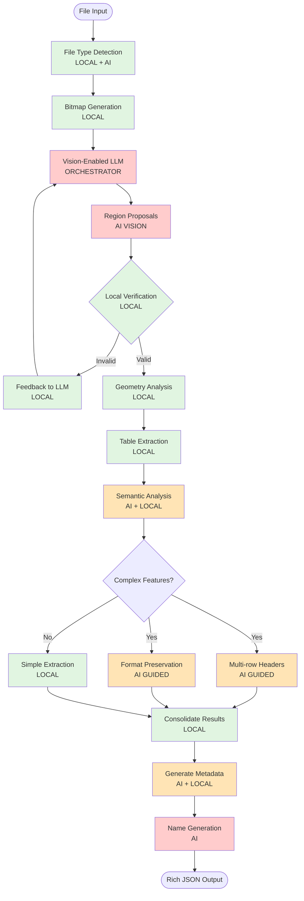

# GridPorter Agent Architecture

## Overview

GridPorter uses a vision-enabled AI orchestration architecture where Large Language Models (LLMs) with vision capabilities guide the table detection process, with local algorithms providing verification and refinement. This approach enables understanding of complex spreadsheet structures that traditional algorithms miss.

## Architecture Principles

1. **Vision-First Detection**: Visual understanding drives initial table identification
2. **AI-Guided Orchestration**: LLMs coordinate the detection pipeline based on visual analysis
3. **Local Verification**: Deterministic algorithms validate AI proposals for reliability
4. **Semantic Preservation**: Maintain table meaning and structure during extraction
5. **Rich Metadata Output**: Provide comprehensive information for perfect data import

## Agent Workflow



**Legend:**
- 🟢 Green: Local processing (deterministic)
- 🟠 Orange: Hybrid AI + Local processing
- 🔴 Red: AI/LLM processing (vision or text)

## Vision-Enabled Detection Pipeline

### 1. Bitmap Generation

Convert spreadsheet filled cells into visual representation:

```python
class BitmapGenerator:
    """Generate visual representation of spreadsheet structure"""

    def generate_bitmap(self, sheet_data: np.ndarray) -> np.ndarray:
        """Convert filled cells to bitmap"""
        # Create binary mask of filled vs empty cells
        filled_mask = ~pd.isna(sheet_data) & (sheet_data != '')

        # Optional: Add formatting information as different intensities
        bitmap = self._add_format_intensity(filled_mask, sheet_data)

        # Resize for optimal vision model processing
        return self._optimize_resolution(bitmap)

    def generate_region_overlay(self, bitmap: np.ndarray,
                              regions: List[BoundingBox]) -> np.ndarray:
        """Overlay proposed regions for verification"""
        return self._draw_bounding_boxes(bitmap, regions)
```

### 2. Vision Model Integration

```python
class VisionOrchestrator:
    """Orchestrate table detection using vision models"""

    def __init__(self, config: Config):
        if config.vision_model == "gpt-4-vision":
            self.vision_llm = OpenAIVision(model="gpt-4-vision-preview")
        elif config.vision_model == "claude-3-vision":
            self.vision_llm = ClaudeVision(model="claude-3-opus")
        elif config.vision_model == "qwen2-vl":
            self.vision_llm = OllamaVision(model="qwen2.5-vl:7b")

    async def propose_regions(self, bitmap: np.ndarray,
                            context: Dict) -> List[RegionProposal]:
        """Use vision model to propose table regions"""

        prompt = """Analyze this spreadsheet visualization where filled cells are shown as dark pixels.

        Identify distinct table regions by looking for:
        1. Rectangular clusters of filled cells
        2. Natural boundaries (empty rows/columns)
        3. Visual patterns suggesting headers
        4. Indentation patterns (hierarchical data)

        For each region, provide:
        - Bounding box coordinates
        - Confidence score
        - Table characteristics (has_headers, is_sparse, has_indentation)

        Return as JSON: {"regions": [...]}
        """

        response = await self.vision_llm.analyze(bitmap, prompt)
        return self._parse_region_proposals(response)
```

### 3. Region Verification & Geometry Analysis

```python
class RegionVerifier:
    """Verify AI-proposed regions using local algorithms"""

    def verify_region(self, sheet_data: np.ndarray,
                     proposal: RegionProposal) -> VerificationResult:
        """Verify proposed region is valid table"""

        region_data = self._extract_region(sheet_data, proposal.bbox)

        # Check rectangularness
        rectangularness = self._compute_rectangularness(region_data)

        # Check data density
        filledness = self._compute_filledness(region_data)

        # Check consistency
        consistency = self._check_data_consistency(region_data)

        return VerificationResult(
            is_valid=rectangularness > 0.7 and filledness > 0.3,
            metrics={
                'rectangularness': rectangularness,
                'filledness': filledness,
                'consistency': consistency
            },
            feedback=self._generate_feedback(rectangularness, filledness)
        )

    def _compute_rectangularness(self, data: np.ndarray) -> float:
        """Measure how rectangular the filled region is"""
        filled_mask = ~pd.isna(data) & (data != '')

        # Find minimal bounding rectangle
        rows, cols = np.where(filled_mask)
        if len(rows) == 0:
            return 0.0

        min_row, max_row = rows.min(), rows.max()
        min_col, max_col = cols.min(), cols.max()

        # Compare filled cells to rectangle area
        rect_area = (max_row - min_row + 1) * (max_col - min_col + 1)
        filled_area = filled_mask.sum()

        return filled_area / rect_area if rect_area > 0 else 0.0
```

### 4. Semantic Table Understanding

```python
class SemanticAnalyzer:
    """Understand table semantics with AI assistance"""

    async def analyze_table_structure(self, table_data: np.ndarray,
                                    vision_context: Dict) -> TableSemantics:
        """Analyze complex table structures"""

        # Use LLM to understand structure
        structure_prompt = f"""Given this table data and visual analysis:
        {vision_context}

        Identify:
        1. Number of header rows (might be multiple)
        2. Indented rows (for hierarchical data like financials)
        3. Blank rows that should be preserved
        4. Merged cell patterns
        5. Data type patterns

        Return structured analysis.
        """

        llm_analysis = await self.llm.analyze(
            table_snippet=self._prepare_snippet(table_data),
            prompt=structure_prompt
        )

        # Verify with local heuristics
        local_analysis = self._local_structure_analysis(table_data)

        # Combine insights
        return self._merge_analyses(llm_analysis, local_analysis)
```

## Enhanced Output Format

The system generates rich metadata for perfect pandas import:

```python
@dataclass
class EnhancedTableInfo:
    """Rich table information for perfect extraction"""

    # Basic info
    name: str
    sheet: str
    range: str

    # Structure
    header_config: HeaderConfig
    data_start_row: int

    # Formatting preservation
    formatting: FormattingInfo

    # Pandas import parameters
    pandas_kwargs: Dict[str, Any]

    # Validation
    confidence_scores: Dict[str, float]

@dataclass
class HeaderConfig:
    """Complex header configuration"""
    num_rows: int
    merged_cells: List[str]
    column_spans: Dict[int, List[Tuple[int, int]]]

@dataclass
class FormattingInfo:
    """Formatting to preserve semantics"""
    indented_rows: List[int]  # For hierarchical data
    blank_rows: List[int]     # Semantic separators
    subtotal_rows: List[int]  # Summary rows
    formatting_patterns: Dict[str, Any]
```

## Cost Optimization Strategies

### 1. Intelligent Bitmap Resolution

```python
class ResolutionOptimizer:
    """Optimize bitmap resolution for cost/accuracy tradeoff"""

    def optimize_for_vision(self, sheet_size: Tuple[int, int]) -> Tuple[int, int]:
        """Determine optimal resolution"""
        rows, cols = sheet_size

        # Use lower resolution for initial detection
        if rows * cols > 10000:
            # Downsample large sheets
            return (min(rows, 200), min(cols, 50))
        else:
            # Full resolution for small sheets
            return sheet_size
```

### 2. Caching Strategy

```python
class VisionCache:
    """Cache vision API responses"""

    def get_cached_regions(self, bitmap_hash: str) -> Optional[List[RegionProposal]]:
        """Check if we've seen similar structure"""
        return self.region_cache.get(bitmap_hash)

    def cache_regions(self, bitmap_hash: str, regions: List[RegionProposal]):
        """Cache for similar sheets"""
        self.region_cache[bitmap_hash] = regions
```

### 3. Batch Processing

```python
async def process_workbook_batch(self, workbook: Workbook) -> List[TableInfo]:
    """Process multiple sheets in single vision call"""

    # Generate composite bitmap
    composite = self._create_sheet_mosaic(workbook.sheets)

    # Single vision API call
    all_regions = await self.vision_orchestrator.propose_regions_batch(composite)

    # Map back to individual sheets
    return self._distribute_regions(all_regions, workbook.sheets)
```

## Configuration Examples

### Vision-Enabled with GPT-4V
```python
GridPorter(
    vision_model="gpt-4-vision",
    vision_confidence_threshold=0.8,
    enable_semantic_analysis=True,
    preserve_formatting=True
)
```

### Local Vision with Ollama
```python
GridPorter(
    vision_model="qwen2-vl:7b",
    ollama_url="http://localhost:11434",
    bitmap_resolution="adaptive",
    verification_mode="strict"
)
```

### Hybrid Mode (Vision + Traditional)
```python
GridPorter(
    detection_mode="hybrid",
    vision_model="claude-3-opus",
    fallback_to_traditional=True,
    complexity_threshold=0.7  # Use vision for complex sheets
)
```

## Implementation Phases

### Phase 1: Vision Infrastructure
- Bitmap generation from spreadsheets
- Vision model integration (OpenAI, Anthropic, Ollama)
- Basic region proposal system

### Phase 2: Verification Pipeline
- Local verification algorithms
- Geometry analysis (rectangularness, filledness)
- Feedback loop implementation

### Phase 3: Semantic Understanding
- Multi-row header detection
- Hierarchical data handling
- Format preservation logic

### Phase 4: Production Optimization
- Caching system
- Batch processing
- Cost monitoring

## Summary

This architecture revolutionizes spreadsheet understanding by:

1. **Using visual AI** to understand table layout as humans do
2. **Orchestrating with intelligence** rather than rigid algorithms
3. **Preserving semantics** that traditional parsers destroy
4. **Providing rich metadata** for perfect data extraction
5. **Optimizing costs** through intelligent caching and batching

The result is a system that can handle the messiest real-world spreadsheets with the accuracy of human understanding and the reliability of automated verification.
