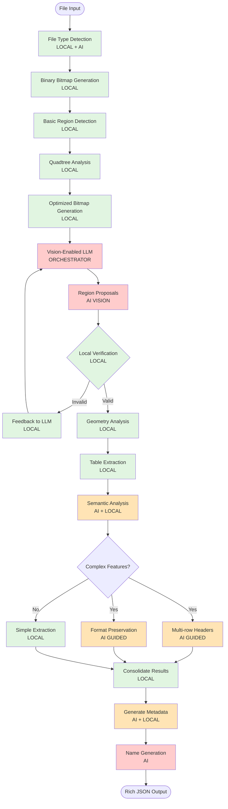

# GridPorter Agent Architecture

## Overview

GridPorter uses a vision-enabled AI orchestration architecture where Large Language Models (LLMs) with vision capabilities guide the table detection process, with local algorithms providing verification and refinement. This approach enables understanding of complex spreadsheet structures that traditional algorithms miss.

## Architecture Principles

1. **Vision-First Detection**: Visual understanding drives initial table identification
2. **AI-Guided Orchestration**: LLMs coordinate the detection pipeline based on visual analysis
3. **Local Verification**: Deterministic algorithms validate AI proposals for reliability
4. **Semantic Preservation**: Maintain table meaning and structure during extraction
5. **Rich Metadata Output**: Provide comprehensive information for perfect data import

## Agent Workflow



**Legend:**
- 🟢 Green: Local processing (deterministic)
- 🟠 Orange: Hybrid AI + Local processing
- 🔴 Red: AI/LLM processing (vision or text)

## Vision-Enabled Detection Pipeline

### 1. Binary Bitmap Generation

Generate full-resolution binary bitmap for analysis:

```python
class BitmapAnalyzer:
    """Generate and analyze bitmap representations"""

    def generate_binary_bitmap(self, sheet_data: SheetData) -> Tuple[np.ndarray, dict]:
        """Generate 1-bit bitmap at full resolution"""
        # Efficient vectorized generation
        # Preserves actual dimensions for accurate analysis
```

### 3. Quadtree-Based Visualization Planning

Optimize bitmap generation using spatial analysis:

```python
class QuadtreeAnalyzer:
    """Build structure-aware quadtree for efficient visualization"""

    def analyze(self, sheet_data: SheetData, patterns: List[TablePattern]) -> QuadTree:
        """Create quadtree that respects table boundaries"""

        # Initialize quadtree with sheet bounds
        quadtree = QuadTree(
            bounds=(0, 0, sheet_data.max_row, sheet_data.max_column),
            max_depth=8,
            min_size=100  # Don't split below 100 cells
        )

        # Build tree respecting patterns
        self._build_pattern_aware_tree(quadtree.root, sheet_data, patterns)

        return quadtree

    def plan_visualization(self, quadtree: QuadTree, max_regions: int = 10) -> List[VisualizationRegion]:
        """Plan optimal regions for bitmap generation"""

        # Get non-empty leaf nodes
        data_nodes = quadtree.get_nodes_with_data()

        # Prioritize by data density and size
        prioritized = self._prioritize_nodes(data_nodes)

        # Select top regions within GPT-4o constraints
        selected = self._select_regions_for_visualization(
            prioritized,
            max_regions=max_regions,
            max_total_size_mb=20
        )

        return selected
```

### 4. Memory-Efficient Bitmap Generation

Convert spreadsheet filled cells into optimized visual representation:

```python
class BitmapGenerator:
    """Generate memory-efficient visual representation of spreadsheet structure"""

    def __init__(self, bits_per_cell: int = None, compression_level: int = 6):
        self.bits_per_cell = bits_per_cell  # Auto-select if None
        self.compression_level = compression_level
        self.max_image_size_mb = 20  # GPT-4o limit

    def generate_bitmap(self, sheet_data: SheetData,
                       visualization_plan: VisualizationPlan) -> List[BitmapResult]:
        """Generate optimized bitmaps based on visualization plan"""

        results = []

        for region in visualization_plan.regions:
            # Select appropriate representation
            if region.total_cells > 1_000_000:
                bitmap = self._generate_sampled(sheet_data, region)
            elif region.total_cells > 100_000:
                bitmap = self._generate_compressed(sheet_data, region, bits=2)
            else:
                bitmap = self._generate_full(sheet_data, region)

            # Ensure GPT-4o compatibility
            if len(bitmap) > self.max_image_size_mb * 1024 * 1024:
                bitmap = self._recompress_for_size(bitmap)

            results.append(BitmapResult(
                image_data=bitmap,
                metadata=region.metadata,
                compression_info=self._get_compression_info(bitmap)
            ))

        return results

    def _generate_compressed(self, sheet_data: SheetData, region: Region, bits: int = 2):
        """Generate bitmap with compressed cell representation"""

        # Extract region data
        region_data = self._extract_region(sheet_data, region.bounds)

        # Encode cells with reduced bits
        if bits == 2:
            # 2-bit: empty (00), filled (01), header (10), special (11)
            encoded = self._encode_2bit(region_data)
        elif bits == 4:
            # 4-bit: more nuanced representation
            encoded = self._encode_4bit(region_data)

        # Convert to PNG with compression
        return self._to_png(encoded, compression_level=self.compression_level)
```

### 5. Vision Model Integration

```python
class VisionOrchestrator:
    """Orchestrate table detection using vision models"""

    def __init__(self, config: Config):
        if config.vision_model == "gpt-4o":
            self.vision_llm = OpenAIVision(model="gpt-4o")
        elif config.vision_model == "qwen2-vl":
            self.vision_llm = OllamaVision(model="qwen2.5-vl:7b")

    async def propose_regions(self, bitmap: np.ndarray,
                            context: Dict) -> List[RegionProposal]:
        """Use vision model to propose table regions"""

        prompt = """Analyze this spreadsheet visualization where filled cells are shown as dark pixels.

        Identify distinct table regions by looking for:
        1. Rectangular clusters of filled cells
        2. Natural boundaries (empty rows/columns)
        3. Visual patterns suggesting headers
        4. Indentation patterns (hierarchical data)

        For each region, provide:
        - Bounding box coordinates
        - Confidence score
        - Table characteristics (has_headers, is_sparse, has_indentation)

        Return as JSON: {"regions": [...]}
        """

        response = await self.vision_llm.analyze(bitmap, prompt)
        return self._parse_region_proposals(response)
```

### 6. Region Verification & Geometry Analysis

```python
class RegionVerifier:
    """Verify AI-proposed regions using local algorithms"""

    def verify_region(self, sheet_data: np.ndarray,
                     proposal: RegionProposal) -> VerificationResult:
        """Verify proposed region is valid table"""

        region_data = self._extract_region(sheet_data, proposal.bbox)

        # Check rectangularness
        rectangularness = self._compute_rectangularness(region_data)

        # Check data density
        filledness = self._compute_filledness(region_data)

        # Check consistency
        consistency = self._check_data_consistency(region_data)

        return VerificationResult(
            is_valid=rectangularness > 0.7 and filledness > 0.3,
            metrics={
                'rectangularness': rectangularness,
                'filledness': filledness,
                'consistency': consistency
            },
            feedback=self._generate_feedback(rectangularness, filledness)
        )

    def _compute_rectangularness(self, data: np.ndarray) -> float:
        """Measure how rectangular the filled region is"""
        filled_mask = ~pd.isna(data) & (data != '')

        # Find minimal bounding rectangle
        rows, cols = np.where(filled_mask)
        if len(rows) == 0:
            return 0.0

        min_row, max_row = rows.min(), rows.max()
        min_col, max_col = cols.min(), cols.max()

        # Compare filled cells to rectangle area
        rect_area = (max_row - min_row + 1) * (max_col - min_col + 1)
        filled_area = filled_mask.sum()

        return filled_area / rect_area if rect_area > 0 else 0.0
```

### 7. Semantic Table Understanding

```python
class SemanticAnalyzer:
    """Understand table semantics with AI assistance"""

    async def analyze_table_structure(self, table_data: np.ndarray,
                                    vision_context: Dict) -> TableSemantics:
        """Analyze complex table structures"""

        # Use LLM to understand structure
        structure_prompt = f"""Given this table data and visual analysis:
        {vision_context}

        Identify:
        1. Number of header rows (might be multiple)
        2. Indented rows (for hierarchical data like financials)
        3. Blank rows that should be preserved
        4. Merged cell patterns
        5. Data type patterns

        Return structured analysis.
        """

        llm_analysis = await self.llm.analyze(
            table_snippet=self._prepare_snippet(table_data),
            prompt=structure_prompt
        )

        # Verify with local heuristics
        local_analysis = self._local_structure_analysis(table_data)

        # Combine insights
        return self._merge_analyses(llm_analysis, local_analysis)
```

## Enhanced Output Format

The system generates rich metadata for perfect pandas import:

```python
@dataclass
class EnhancedTableInfo:
    """Rich table information for perfect extraction"""

    # Basic info
    name: str
    sheet: str
    range: str

    # Structure
    header_config: HeaderConfig
    data_start_row: int

    # Formatting preservation
    formatting: FormattingInfo

    # Pandas import parameters
    pandas_kwargs: Dict[str, Any]

    # Validation
    confidence_scores: Dict[str, float]

@dataclass
class HeaderConfig:
    """Complex header configuration"""
    num_rows: int
    merged_cells: List[str]
    column_spans: Dict[int, List[Tuple[int, int]]]

@dataclass
class FormattingInfo:
    """Formatting to preserve semantics"""
    indented_rows: List[int]  # For hierarchical data
    blank_rows: List[int]     # Semantic separators
    subtotal_rows: List[int]  # Summary rows
    formatting_patterns: Dict[str, Any]
```

## Handling Large and Sparse Spreadsheets

### Key Challenges
1. **Excel Size Limits**: Recent Excel supports 1M×16K cells (17B cells total)
2. **Memory Constraints**: Full bitmap would require 17GB+ memory
3. **GPT-4o Limits**: 20MB max image size
4. **Sparse Data**: Most cells empty but structure must be preserved

### Solution Architecture

```python
class LargeSheetPipeline:
    """Pipeline for handling large and sparse spreadsheets"""

    def process_large_sheet(self, sheet_data: SheetData) -> VisionAnalysisResult:
        # Step 1: Generate binary bitmap
        bitmap, metadata = self.bitmap_analyzer.generate_binary_bitmap(sheet_data)

        # Step 2: Detect regions using connected components
        regions = self.bitmap_analyzer.detect_connected_regions(bitmap)

        # Step 3: Build structure-aware quadtree
        quadtree = self.quadtree_analyzer.analyze(sheet_data, regions)

        # Step 4: Plan visualization strategy
        plan = self.visualization_planner.create_plan(
            tables=tables,
            quadtree=quadtree,
            constraints=GPT4oConstraints(max_size_mb=20, max_regions=10)
        )

        # Step 5: Generate optimized bitmaps
        bitmaps = self.bitmap_generator.generate_from_plan(sheet_data, plan)

        # Step 6: Send to vision model
        results = []
        for bitmap in bitmaps:
            result = await self.vision_model.analyze(
                bitmap.image_data,
                context=bitmap.metadata
            )
            results.append(result)

        return self._consolidate_results(results)
```

## Cost Optimization Strategies

### 1. Intelligent Bitmap Resolution

```python
class ResolutionOptimizer:
    """Optimize bitmap resolution for cost/accuracy tradeoff"""

    def optimize_for_vision(self, sheet_size: Tuple[int, int]) -> Tuple[int, int]:
        """Determine optimal resolution"""
        rows, cols = sheet_size

        # Use lower resolution for initial detection
        if rows * cols > 10000:
            # Downsample large sheets
            return (min(rows, 200), min(cols, 50))
        else:
            # Full resolution for small sheets
            return sheet_size
```

### 2. Caching Strategy

```python
class VisionCache:
    """Cache vision API responses"""

    def get_cached_regions(self, bitmap_hash: str) -> Optional[List[RegionProposal]]:
        """Check if we've seen similar structure"""
        return self.region_cache.get(bitmap_hash)

    def cache_regions(self, bitmap_hash: str, regions: List[RegionProposal]):
        """Cache for similar sheets"""
        self.region_cache[bitmap_hash] = regions
```

### 3. Batch Processing

```python
async def process_workbook_batch(self, workbook: Workbook) -> List[TableInfo]:
    """Process multiple sheets in single vision call"""

    # Generate composite bitmap
    composite = self._create_sheet_mosaic(workbook.sheets)

    # Single vision API call
    all_regions = await self.vision_orchestrator.propose_regions_batch(composite)

    # Map back to individual sheets
    return self._distribute_regions(all_regions, workbook.sheets)
```

## Configuration Examples

### Vision-Enabled with GPT-4o
```python
GridPorter(
    vision_model="gpt-4o",
    vision_confidence_threshold=0.8,
    enable_semantic_analysis=True,
    preserve_formatting=True
)
```

### Local Vision with Ollama
```python
GridPorter(
    vision_model="qwen2-vl:7b",
    ollama_url="http://localhost:11434",
    bitmap_resolution="adaptive",
    verification_mode="strict"
)
```

### Hybrid Mode (Vision + Traditional)
```python
GridPorter(
    detection_mode="hybrid",
    vision_model="gpt-4o",
    fallback_to_traditional=True,
    complexity_threshold=0.7  # Use vision for complex sheets
)
```

### Default Mode (Best Performance)
```python
GridPorter(
    vision_model="gpt-4o"
)
```

### Large Sparse Spreadsheet Mode
```python
GridPorter(
    vision_model="gpt-4o",
    enable_sparse_detection=True,
    enable_quadtree_optimization=True,
    bits_per_cell=2,  # Use compressed representation
    max_image_size_mb=20,  # GPT-4o limit
    compression_level=6,  # PNG compression
    max_regions_per_sheet=10  # Limit number of images
)
```

## Implementation Phases

### Phase 1: Vision Infrastructure
- Binary bitmap generation from spreadsheets
- Basic connected component detection
- Vision model integration (OpenAI, Ollama)
- Basic region proposal system
- Quadtree-based visualization planning
- Memory-efficient bitmap modes (2/4-bit)
- GPT-4o size optimization (<20MB)
- Pattern-aware verification for sparse patterns
- **COMPLETE**: Hierarchical pattern detection (PatternType.HIERARCHICAL)

### Phase 2: Verification Pipeline
- Local verification algorithms
- Geometry analysis (rectangularness, filledness)
- Feedback loop implementation
- Accuracy improvements

### Phase 3: Semantic Understanding
- Multi-row header detection
- **Hierarchical data handling** (fully implemented)
  - Detects indented rows (e.g., financial statements)
  - Identifies parent-child relationships
  - Finds subtotal/total rows
  - Preserves hierarchical structure for analysis
- Format preservation logic
- **NEW**: Sparse table structure preservation

### Phase 4: Production Optimization
- Caching system
- Batch processing
- Cost monitoring
- **NEW**: Adaptive representation selection
- **NEW**: Hierarchical visualization for large sheets

## Summary

This architecture revolutionizes spreadsheet understanding by:

This architecture revolutionizes spreadsheet understanding by:

1. **Using visual AI** to understand table layout as humans do
2. **Fast bitmap generation** for spatial analysis
3. **Efficient region detection** using connected components
4. **Quadtree optimization** for handling large sheets
5. **Smart visualization planning** within GPT-4o's 20MB limit
6. **Handling massive spreadsheets** up to Excel's limits (1M×16K cells)
7. **Adaptive compression** based on sheet size and density
8. **Pattern detection** for sparse data structures
9. **Multi-scale analysis** from full sheet to individual regions
10. **Robust verification** to ensure accuracy

The result is a system that can handle the messiest real-world spreadsheets with the accuracy of human understanding and the reliability of automated verification, while efficiently processing even the largest Excel files.
