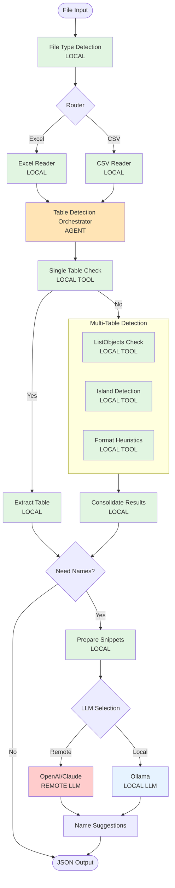

# GridPorter Agent Architecture

## Overview

GridPorter uses a cost-efficient, local-first architecture where AI agents orchestrate locally-run detection algorithms. LLM calls are minimized and used strategically only for naming suggestions and handling ambiguous cases.

## Architecture Principles

1. **Local-First Processing**: All table detection algorithms run locally without LLM calls
2. **Snippet-Based LLM Interaction**: Only send table headers and samples, not full data
3. **Single Orchestrator Pattern**: One agent coordinates multiple local tools
4. **Optional Local LLMs**: Support for Ollama and other local models
5. **Aggressive Caching**: Cache LLM responses for similar patterns

## Agent Workflow



**Legend:**
- 🟢 Green: Local processing (no LLM)
- 🟠 Orange: Agent orchestration (minimal LLM)
- 🔴 Red: Remote LLM calls (expensive)
- 🔵 Blue: Local LLM calls (cheaper)

## Cost Optimization Strategies

### 1. Local Detection Tools (Phase 2)

All detection algorithms are implemented as local tools that the agent can call:

```python
class DetectionTools:
    """Local tools that run without LLM calls"""
    
    @tool
    def check_single_table(self, sheet_data: np.ndarray) -> SingleTableResult:
        """Fast check if sheet contains only one table"""
        # Pure algorithmic detection
        return SingleTableResult(is_single=True, confidence=0.95)
    
    @tool
    def detect_list_objects(self, workbook: Workbook) -> List[TableRange]:
        """Extract Excel's native table objects"""
        # Direct Excel API calls
        return extracted_tables
    
    @tool
    def detect_islands(self, sheet_data: np.ndarray) -> List[TableRange]:
        """Mask-based island detection using image processing"""
        # scikit-image algorithms
        return detected_islands
```

### 2. Single Orchestrator Agent

Only one agent is needed to coordinate the workflow:

```python
class TableDetectorAgent:
    """Orchestrates detection pipeline with minimal LLM usage"""
    
    async def detect_tables(self, file_path: str) -> DetectionResult:
        # Step 1: Local file analysis
        file_info = self.tools.analyze_file(file_path)  # LOCAL
        
        # Step 2: Run detection pipeline
        if self.tools.check_single_table(file_data):    # LOCAL
            tables = [self.tools.extract_single_table()] # LOCAL
        else:
            tables = self.tools.detect_multiple_tables() # LOCAL
        
        # Step 3: Optional naming (only LLM call)
        if self.config.suggest_names:
            snippets = self._prepare_snippets(tables)    # LOCAL
            names = await self._suggest_names(snippets)  # LLM (remote or local)
            
        return DetectionResult(tables=tables)
```

### 3. Snippet Preparation

Instead of sending full table data, prepare minimal snippets:

```python
def _prepare_snippets(self, tables: List[Table]) -> List[TableSnippet]:
    """Prepare minimal data for LLM naming"""
    snippets = []
    for table in tables:
        snippet = TableSnippet(
            headers=table.headers[:10],        # Max 10 headers
            sample_rows=table.data[:3],        # Only 3 rows
            shape=(table.rows, table.cols),    # Just dimensions
            has_numeric=table.has_numeric_data # Boolean flag
        )
        snippets.append(snippet)
    return snippets
```

### 4. Local LLM Integration

Support for Ollama and other local models:

```python
class LLMProvider:
    def __init__(self, config: Config):
        if config.use_local_llm:
            self.llm = OllamaClient(
                model=config.local_model,  # e.g., "llama2", "mistral"
                base_url="http://localhost:11434"
            )
        else:
            self.llm = OpenAIClient(
                api_key=config.openai_api_key,
                model=config.remote_model  # e.g., "gpt-4o-mini"
            )
    
    async def suggest_names(self, snippets: List[TableSnippet]) -> List[str]:
        # Batch all snippets in one call
        prompt = self._build_naming_prompt(snippets)
        response = await self.llm.complete(prompt, max_tokens=200)
        return self._parse_names(response)
```

## Token Usage Optimization

### Batching Strategy
- Process all tables from a file in a single LLM call
- Batch multiple files if processing in bulk

### Prompt Templates
```python
NAMING_PROMPT = """Given these table snippets, suggest short descriptive names:

{snippets}

Return only a JSON array of names like: ["sales_data", "inventory", "customers"]
"""
```

### Caching
```python
class NameCache:
    """Cache similar table patterns"""
    
    def get_cached_name(self, table_signature: str) -> Optional[str]:
        # Check if we've seen similar headers before
        return self.cache.get(table_signature)
    
    def cache_name(self, table_signature: str, name: str):
        self.cache[table_signature] = name
```

## Cost Comparison

| Operation | Remote LLM | Local LLM | No LLM |
|-----------|------------|-----------|---------|
| File type detection | - | - | ✓ |
| Single table check | - | - | ✓ |
| Island detection | - | - | ✓ |
| Format analysis | - | - | ✓ |
| Name suggestion | $0.002/table | ~$0 | - |
| Total per file | ~$0.01 | ~$0 | $0 |

## Implementation Timeline

1. **Phase 2**: Build all local detection tools
2. **Phase 3**: Add thin orchestration layer with optional LLM naming

## Configuration Examples

### Fully Local (No LLM)
```python
GridPorter(
    suggest_names=False,
    detection_only=True
)
```

### Local LLM (Ollama)
```python
GridPorter(
    use_local_llm=True,
    local_model="mistral:7b",
    ollama_url="http://localhost:11434"
)
```

### Hybrid (Local Detection + Remote Naming)
```python
GridPorter(
    use_local_llm=False,
    openai_model="gpt-4o-mini",  # Cheapest option
    max_tokens_per_table=50
)
```

## Summary

The architecture prioritizes:
1. **Local computation** for all detection tasks
2. **Minimal LLM usage** only for naming suggestions
3. **Snippet-based interactions** to reduce tokens
4. **Support for local LLMs** via Ollama
5. **Single agent pattern** to minimize orchestration overhead

This design ensures cost-effective operation while maintaining high-quality table detection and meaningful naming suggestions.