# GridPorter Agent Architecture V2

## Overview

GridPorter uses a vision-enabled AI orchestration architecture where Large Language Models (LLMs) with vision capabilities guide the table detection process, with local algorithms providing verification and refinement. This approach enables understanding of complex spreadsheet structures that traditional algorithms miss.

**Key Update**: This architecture now follows a clean separation between 5 core Agents (decision-makers) and ~40 Tools (executors). See [AGENT_TOOL_ARCHITECTURE.md](./AGENT_TOOL_ARCHITECTURE.md) for details.

## Architecture Principles

1. **Vision-First Detection**: Visual understanding drives initial table identification
2. **AI-Guided Orchestration**: LLMs coordinate the detection pipeline based on visual analysis
3. **Local Verification**: Deterministic algorithms validate AI proposals for reliability
4. **Semantic Preservation**: Maintain table meaning and structure during extraction
5. **Rich Metadata Output**: Provide comprehensive information for perfect data import
6. **Agent-Tool Separation**: Clear boundary between strategic decisions (agents) and tactical execution (tools)

## Agent Workflow with Input/Output Specifications

```mermaid
graph TD
    subgraph "Initial Processing"
        Start(["📁 File Input<br/>━━━━━━━━━━<br/>IN: file_path, options<br/>OUT: file_path, file_bytes"])
        -->|"file_path<br/>file_bytes"| FileTypeDetect["🔍 File Type Detection<br/>━━━━━━━━━━<br/>IN: file_path, file_bytes<br/>OUT: file_format, parser, sheets"]

        FileTypeDetect -->|"parallel paths"| NamedRangeDetect["📑 Named Range Detection<br/>━━━━━━━━━━<br/>IN: workbook<br/>OUT: named_tables[], list_objects[]"]

        FileTypeDetect -->|"file_path<br/>sheet_name<br/>parser"| DataPreprocess["🔎 Data Region Pre-process<br/>━━━━━━━━━━<br/>IN: sheet_data<br/>OUT: data_regions[], bounds, density"]

        NamedRangeDetect -->|"pre_detected<br/>tables"| TableDecision{"📊 Tables Found?<br/>━━━━━━━━━━<br/>IN: named_tables<br/>OUT: use_vision_bool"}

        TableDecision -->|"✓ Yes<br/>skip vision"| DirectExtract["📤 Direct Extraction<br/>━━━━━━━━━━<br/>IN: named_tables<br/>OUT: table_proposals[]"]

        TableDecision -->|"❌ No<br/>continue"| DataPreprocess

        DataPreprocess -->|"data_bounds<br/>actual_size"| CompressionDecision{"🗜️ Need Compression?<br/>━━━━━━━━━━<br/>IN: populated_cells<br/>OUT: compression_levels[]"}

        CompressionDecision -->|"< 10K cells<br/>no compression"| SingleBitmap["🖼️ Single Bitmap<br/>━━━━━━━━━━<br/>IN: sheet_data<br/>OUT: full_res_image"]

        CompressionDecision -->|"> 10K cells<br/>multi-scale"| MultiScaleBitmap["🟦 Multi-Scale Bitmap Gen<br/>━━━━━━━━━━<br/>IN: sheet_data, data_bounds<br/>OUT: overview, detail_views[]"]
    end

    subgraph "Vision Preparation"
        SingleBitmap -->|"image"| VisionRequest["🖼️ Vision Request Builder<br/>━━━━━━━━━━<br/>IN: images[], strategy<br/>OUT: vision_request{}"]

        MultiScaleBitmap -->|"multi_scale<br/>images"| VisionRequest

        DirectExtract -->|"skip vision<br/>path"| LocalVerify
    end

    subgraph "Vision Analysis & Verification"
        VisionRequest -->|"vision_request<br/>with context"| VisionLLM["🤖 Vision-Enabled LLM<br/>━━━━━━━━━━<br/>IN: images[], context_cells<br/>OUT: exact_bounds[], confidence"]

        VisionLLM -->|"proposals[]<br/>insights"| RegionProposal["📋 Region Proposals<br/>━━━━━━━━━━<br/>IN: vision_analysis, regions<br/>OUT: region_proposals[]"]

        RegionProposal -->|"proposal<br/>bounds"| LocalVerify{"✅ Local Verification<br/>━━━━━━━━━━<br/>IN: sheet_data, proposal<br/>OUT: is_valid, metrics"}

        LocalVerify -->|"❌ Invalid<br/>feedback"| Feedback["🔄 Feedback to LLM<br/>━━━━━━━━━━<br/>IN: invalid_proposals<br/>OUT: refined_prompt"]

        Feedback -->|"refined_prompt<br/>retry_params"| VisionLLM
    end

    subgraph "Data Extraction"
        LocalVerify -->|"✓ Valid<br/>verified_region"| GeometryCheck["📐 Geometry Analysis<br/>━━━━━━━━━━<br/>IN: sheet_data, region<br/>OUT: geometry, patterns"]

        GeometryCheck -->|"geometry<br/>bounds"| TableExtract["📊 Table Extraction<br/>━━━━━━━━━━<br/>IN: sheet_data, geometry<br/>OUT: raw_data[][], metadata"]

        TableExtract -->|"raw_data<br/>metadata"| SemanticAnalysis["🧠 Semantic Analysis<br/>━━━━━━━━━━<br/>IN: raw_data, insights<br/>OUT: table_type, fields, complexity"]
    end

    subgraph "Feature Processing"
        SemanticAnalysis -->|"semantic_analysis"| ComplexFeatures{"🔀 Complex Features?<br/>━━━━━━━━━━<br/>IN: semantic_analysis<br/>OUT: decision, routing"}

        ComplexFeatures -->|"📑 Complex<br/>header_info"| HeaderAnalysis["📑 Multi-row Headers<br/>━━━━━━━━━━<br/>IN: raw_data, header_struct<br/>OUT: unified_headers[]"]

        ComplexFeatures -->|"🎨 Complex<br/>format_info"| FormatAnalysis["🎨 Format Preservation<br/>━━━━━━━━━━<br/>IN: metadata, structure<br/>OUT: formatting_rules"]

        ComplexFeatures -->|"📝 Simple<br/>table_data"| SimpleExtract["📝 Simple Extraction<br/>━━━━━━━━━━<br/>IN: table_data, analysis<br/>OUT: headers[], data[][]"]
    end

    subgraph "Final Assembly"
        HeaderAnalysis -->|"headers<br/>mappings"| Consolidate["🔗 Consolidate Results<br/>━━━━━━━━━━<br/>IN: all_extractions<br/>OUT: consolidated_table"]
        FormatAnalysis -->|"format_rules"| Consolidate
        SimpleExtract -->|"simple_table"| Consolidate

        Consolidate -->|"consolidated<br/>table"| MetadataGen["📝 Generate Metadata<br/>━━━━━━━━━━<br/>IN: table, insights<br/>OUT: pandas_config, hints"]

        MetadataGen -->|"metadata<br/>table_info"| NameGen["🏷️ Name Generation<br/>━━━━━━━━━━<br/>IN: table_data, headers<br/>OUT: name, description"]

        NameGen -->|"complete<br/>result"| Output(["📦 Rich JSON Output<br/>━━━━━━━━━━<br/>IN: all_tables, metrics<br/>OUT: extraction_result{}"])
    end

    style DataPreprocess fill:#e1f5e1
    style MultiScaleBitmap fill:#e1f5e1
    style SingleBitmap fill:#e1f5e1
    style FileTypeDetect fill:#e1f5e1
    style NamedRangeDetect fill:#e1f5e1
    style DirectExtract fill:#e1f5e1
    style LocalVerify fill:#e1f5e1
    style GeometryCheck fill:#e1f5e1
    style TableExtract fill:#e1f5e1
    style SimpleExtract fill:#e1f5e1
    style Consolidate fill:#e1f5e1
    style Feedback fill:#e1f5e1
    style VisionRequest fill:#e1f5e1
    style CompressionDecision fill:#e1f5e1
    style TableDecision fill:#e1f5e1
    style VisionLLM fill:#ffcccc
    style RegionProposal fill:#ffcccc
    style SemanticAnalysis fill:#ffe4b5
    style HeaderAnalysis fill:#ffe4b5
    style FormatAnalysis fill:#ffe4b5
    style MetadataGen fill:#ffe4b5
    style NameGen fill:#ffcccc
```



### Data Flow Legend

- **file_path**: Path to spreadsheet file
- **file_bytes**: First 1KB for magic detection
- **named_tables**: Excel ListObjects and named ranges that define tables
- **data_bounds**: Actual populated area (max_row, max_col with data)
- **compression_levels**: Dynamic compression based on actual data size
- **context_cells**: 5-10 cells around proposed boundaries for LLM context
- **field_descriptions**: Semantic descriptions of each column's purpose
- **pandas_config**: Ready-to-use pd.read_excel() parameters

### Processing Type Legend
- 🟢 **Green**: Local processing (deterministic tools)
- 🟠 **Orange**: Hybrid AI + Local processing (agents)
- 🔴 **Red**: AI/LLM processing (vision or text)

## Detailed Step Specifications

### 0. Start (File Input)

**Description**: Initial entry point receiving file path or file object

**Input**:
```json
{
  "file_path": "path/to/spreadsheet.xlsx",
  "options": {
    "sheets": null,  // null for all sheets, or ["Sheet1", "Sheet2"]
    "max_file_size_mb": 100,
    "timeout_seconds": 300,
    "vision_model": "gpt-4o",
    "enable_caching": true,
    "check_named_ranges": true  // NEW: Enable fast path
  }
}
```

**Output**:
```json
{
  "file_path": "path/to/spreadsheet.xlsx",
  "file_bytes": "<first 1024 bytes for magic detection>",
  "request_id": "req_12345",
  "timestamp": "2024-01-15T10:30:00Z"
}
```

### 1. File Type Detection

**Agent**: DetectionAgent (using file_type_detector tool)

**Input**:
```json
{
  "file_path": "path/to/spreadsheet.xlsx",
  "file_bytes": "<first 1024 bytes for magic detection>"
}
```

**Processing**:
- Use python-magic to detect actual file type
- Validate against expected extensions
- Determine appropriate parser
- Check for Excel-specific features

**Output**:
```json
{
  "detected_type": "application/vnd.openxmlformats-officedocument.spreadsheetml.sheet",
  "file_format": "xlsx",
  "parser": "openpyxl",
  "confidence": 1.0,
  "sheets": ["Sheet1", "Sheet2", "Data"],
  "has_list_objects": true,  // NEW: Excel tables present
  "has_named_ranges": true,  // NEW: Named ranges present
  "file_size_bytes": 1048576,
  "processing_hints": {
    "is_large": false,
    "estimated_cells": 50000
  }
}
```

### 1a. Named Range/Defined Table Detection (NEW - Parallel Track)

**Agent**: DetectionAgent (using named_range_detector and list_object_extractor tools)

**Description**: Fast path to detect pre-defined tables without cell analysis

**Input**:
```json
{
  "workbook": "<workbook_object>",
  "sheets": ["Sheet1", "Sheet2", "Data"]
}
```

**Processing**:
- Extract Excel ListObjects (formal tables)
- Extract named ranges that might be tables
- Filter out system ranges (print areas, etc.)
- No cell content analysis needed

**Output**:
```json
{
  "list_objects": [
    {
      "name": "SalesTable",
      "sheet": "Sheet1",
      "range": "A1:E100",
      "has_headers": true,
      "style": "TableStyleMedium9"
    }
  ],
  "named_ranges": [
    {
      "name": "QuarterlyData",
      "sheet": "Data",
      "range": "B5:F50",
      "scope": "Workbook"
    }
  ],
  "pre_detected_count": 2,
  "skip_vision_detection": true
}
```

### 2. Data Region Pre-processing (Updated)

**Description**: Fast scan to identify actual data bounds and density

**Input**:
```json
{
  "sheet_info": {
    "total_rows": 1048576,  // Excel max
    "total_cols": 16384     // Excel max
  },
  "sheet_data": "<sheet_data_reference>"
}
```

**Processing**:
- Binary scan to find max row/column with data
- Calculate actual vs. potential size
- Determine compression needs based on populated cells

**Output**:
```json
{
  "actual_bounds": {
    "min_row": 0,
    "max_row": 5000,      // Actual data ends here
    "min_col": 0,
    "max_col": 100,       // Actual data ends here
    "populated_cells": 45000,
    "sheet_utilization": 0.0043  // % of sheet used
  },
  "data_regions": [
    {
      "region_id": "region_1",
      "bounds": {"top": 0, "left": 0, "bottom": 10, "right": 100},
      "cell_count": 850,
      "density": 0.77,
      "characteristics": {
        "likely_headers": true,
        "mostly_text": true,
        "has_formatting": true
      }
    }
  ],
  "compression_needed": true,
  "recommended_compression": 2  // Based on actual size
}
```

### 2a. Multi-Scale Bitmap Generation (Merged from Step 5)

**Agent**: DetectionAgent (using multi_scale_bitmap_generator tool)

**Description**: Generate appropriate bitmaps based on actual data size

**Input**:
```json
{
  "sheet_data": "<sheet_data_reference>",
  "actual_bounds": {
    "max_row": 5000,
    "max_col": 100,
    "populated_cells": 45000
  },
  "data_regions": [...],
  "compression_strategy": "dynamic"
}
```

**Processing**:
- Use actual bounds, not sheet size, for compression decisions
- Skip compression for sheets < 10K populated cells
- Generate multi-scale only when beneficial
- Include all images in initial generation (no step 5 needed)

**Output**:
```json
{
  "vision_images": [
    {
      "image_id": "overview",
      "compression_level": 2,
      "actual_compression": [64, 1],
      "covers_cells": "A1:CV5001",  // Based on actual bounds
      "size_bytes": 125000,
      "purpose": "overview_detection"
    },
    {
      "image_id": "detail_headers",
      "compression_level": 0,
      "actual_compression": [1, 1],
      "covers_cells": "A1:CV20",
      "size_bytes": 2000,
      "purpose": "header_precision"
    }
  ],
  "generation_strategy": "multi_scale_dynamic",
  "total_size_mb": 0.124
}
```

### 6. Vision LLM Analysis (Enhanced with Detailed Specifications)

**Agent**: VisionAgent (orchestrating vision model interaction)

**Input**:
```json
{
  "vision_request": {
    "images": [...],
    "context_margin": 10,  // Cells around proposed regions
    "include_definitions": true,
    "expected_output_schema": "detailed_bounds_v2"
  }
}
```

**Enhanced Prompt Template**:
```
You are analyzing spreadsheet visualizations to detect precise table boundaries.

DEFINITIONS:
- Rectangularness: The ratio of filled cells to the total cells in the bounding box. A value of 1.0 means perfectly rectangular with no gaps.
- Consistency: The degree to which cells in the same column contain the same data type (text, number, date).
- Alignment: Whether cells form straight edges without scattered data outside the main block.
- Table: A rectangular region with consistent structure, typically with headers and aligned data.

IMAGES PROVIDED:
1. Overview (64:1 compression): Shows overall layout and table distribution
2. Detail views (1:1 scale): EXACT cell-level precision for boundaries

YOUR TASK:
1. Identify all distinct tables in the spreadsheet
2. For each table, examine the CONTEXT AREA (10 cells beyond estimated boundaries)
3. Determine EXACT boundaries where data forms a coherent table
4. Distinguish actual table boundaries from scattered cells

CONTEXT VISUALIZATION:
- Red box: Your proposed table boundary
- Yellow area: Context cells to examine
- Look for natural breaks, empty rows/columns, or format changes

OUTPUT FORMAT:
{
  "tables": [
    {
      "id": "table_1",
      "bounds": {
        "top_row": 5,
        "left_col": 2,
        "bottom_row": 93,
        "right_col": 22
      },
      "confidence": 0.95,
      "evidence": {
        "rectangularness": 0.89,
        "has_headers": true,
        "natural_break_after": true,
        "context_cells_empty": true
      },
      "description": "Sales data table with quarterly columns"
    }
  ],
  "analysis_notes": "Detected 2 tables separated by 5 empty rows"
}
```

**Output with Context**:
```json
{
  "proposals": [
    {
      "proposal_id": "table_1",
      "exact_bounds": {
        "top_row": 5,
        "left_col": 2,
        "bottom_row": 93,
        "right_col": 22
      },
      "context_analysis": {
        "cells_before_top": "Empty for 3 rows",
        "cells_after_bottom": "Empty for 5 rows",
        "cells_left_of_bounds": "All empty",
        "cells_right_of_bounds": "Scattered values, not aligned"
      },
      "confidence_factors": {
        "rectangularness": 0.89,
        "boundary_clarity": 0.92,
        "context_separation": 0.95
      }
    }
  ]
}
```

### 10. Semantic Analysis (Enhanced with Field Descriptions)

**Agent**: AnalysisAgent (using semantic analysis tools)

**Input**:
```json
{
  "raw_data": [...],
  "headers": ["Product", "Q1", "Q2", "Q3", "Q4"],
  "sample_rows": [...],
  "vision_insights": {...}
}
```

**Processing**:
- Analyze each column's content and purpose
- Generate human-readable field descriptions
- Identify data relationships and patterns
- Classify table type and structure

**Output**:
```json
{
  "semantic_analysis": {
    "table_type": "financial_time_series",
    "field_analysis": [
      {
        "field_name": "Product",
        "data_type": "categorical",
        "description": "Product name or category identifier",
        "role": "dimension",
        "characteristics": {
          "unique_values": 45,
          "has_hierarchy": true,
          "null_rate": 0.0
        }
      },
      {
        "field_name": "Q1",
        "data_type": "numeric",
        "description": "First quarter sales revenue in USD",
        "role": "measure",
        "characteristics": {
          "unit": "currency_USD",
          "range": [1000, 50000],
          "aggregatable": true,
          "format": "accounting"
        }
      },
      {
        "field_name": "Q2",
        "data_type": "numeric",
        "description": "Second quarter sales revenue in USD",
        "role": "measure",
        "characteristics": {
          "unit": "currency_USD",
          "range": [1200, 55000],
          "aggregatable": true,
          "format": "accounting"
        }
      }
    ],
    "relationships": {
      "temporal_pattern": "quarterly",
      "hierarchical_structure": "product_categories",
      "aggregation_rules": "sum_by_parent"
    }
  }
}
```

## Repository Organization

Following the Agent-Tool architecture:

```
src/gridporter/
├── agents/                    # 5 Core Agents Only
│   ├── __init__.py
│   ├── base_agent.py
│   ├── pipeline_orchestrator.py
│   ├── detection_agent.py
│   ├── vision_agent.py
│   ├── extraction_agent.py
│   └── analysis_agent.py
│
├── tools/                     # ~40 Deterministic Tools
│   ├── detection/
│   │   ├── file_type_detector.py
│   │   ├── named_range_detector.py    # NEW
│   │   ├── list_object_extractor.py   # NEW
│   │   └── connected_components.py
│   ├── vision/
│   │   ├── bitmap_generator.py
│   │   ├── compression_calculator.py  # NEW: Dynamic compression
│   │   └── context_visualizer.py      # NEW: Add context cells
│   ├── analysis/
│   │   ├── field_descriptor.py        # NEW: Generate descriptions
│   │   └── semantic_classifier.py
│   └── [other tool categories]/
│
└── prompts/
    ├── vision/
    │   ├── multi_scale_detection.json
    │   ├── context_analysis.json       # NEW
    │   └── definitions.json            # NEW
    └── analysis/
        └── field_description.json      # NEW
```

## Test Output Capture System

### Implementation

```python
# tests/utils/output_capture.py
class TestOutputCapture:
    """Captures pipeline inputs/outputs for analysis and refinement."""

    def __init__(self, test_name: str):
        self.test_name = test_name
        self.timestamp = datetime.now().isoformat()
        self.outputs_dir = Path("tests/outputs/captures")

    def capture(self, stage: str, data: Any):
        """Capture data at any pipeline stage."""
        filename = f"{self.timestamp}_{self.test_name}_{stage}.json"
        filepath = self.outputs_dir / filename

        with open(filepath, 'w') as f:
            json.dump(self._serialize(data), f, indent=2)

    def generate_report(self):
        """Generate HTML diff report comparing to golden outputs."""
        # Implementation details...
```

### GitHub Actions Integration

```yaml
# .github/workflows/test-outputs.yml
name: Capture Test Outputs

on: [push, pull_request]

jobs:
  test-and-capture:
    runs-on: ubuntu-latest
    steps:
      - uses: actions/checkout@v3

      - name: Run Tests with Output Capture
        run: |
          pytest tests/ \
            --capture-outputs \
            --output-dir=tests/outputs/captures

      - name: Generate Diff Reports
        run: |
          python scripts/generate_output_diffs.py

      - name: Upload Test Outputs
        uses: actions/upload-artifact@v3
        with:
          name: test-outputs-${{ github.run_id }}
          path: |
            tests/outputs/captures/
            tests/outputs/diffs/

      - name: Comment PR with Results
        if: github.event_name == 'pull_request'
        uses: actions/github-script@v6
        with:
          script: |
            // Post diff summary to PR
```

## Summary of Key Changes

1. **Named Range Detection**: Added parallel fast path for Excel's built-in table definitions
2. **Dynamic Compression**: Based on actual data bounds, not sheet size
3. **Merged Steps**: Combined bitmap generation steps to eliminate redundancy
4. **Enhanced Vision Prompts**: Added context cells, definitions, and detailed output schemas
5. **Field Descriptions**: Semantic analysis now generates human-readable descriptions
6. **Agent-Tool Architecture**: Clean separation between 5 agents and ~40 tools
7. **Test Output Capture**: Systematic capture of inputs/outputs for refinement

This architecture provides a cleaner, more efficient pipeline that can handle both simple cases (pre-defined tables) and complex cases (vision detection) while maintaining high accuracy and performance.
